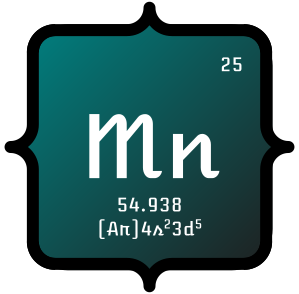

# Manganese



Manganese is a hobby programming language design and compiler implementation project written in C++ on top of the LLVM framework.

> Note: Manganese is currently a work in progress. The compiler pipeline is still being written and is not yet at a point where it can fully compile a program (but hopefully, will be soon).

## Building the project

### Prerequisites

Manganese uses CMake as its build system.

Before building Manganese, make sure you have:

- CMake
- LLVM
- (optionally) Python

### Clone the repository

First, clone the repository

```bash
git clone https://github.com/thementat42/Manganese
cd Manganese
```

### Build using the Python script

[scripts/build.py](scripts/build.py) is a helper script that wraps CMake and provides some convenient build configuration options via command line arguments.

To build the compiler, you can run:

```bash
python scripts/build.py
```

This will place an executable (`manganese`) in `build/`

The build script also has other useful options to configure the build. Run

```bash
python scripts/build.py -h
```

for more information.

### Build using CMake directly

Alternatively, you can configure and build the project directly with CMake:

```bash
mkdir build
cd build
cmake ..
cmake --build .
```

The CMake script has various flags to configure the build process as well.

## Running the test suite

To run the test suite, build the compiler in test mode. This can be done through the python script:

```bash
python scripts/build.py -t
```

or through cmake

```bash
mkdir build
cd build
cmake .. -DCMAKE_BUILD_TYPE=Debug -DBUILD_TESTS=ON
cmake --build .
```

This will produce a `manganese` executable which, when run, runs the test suite (see [tests/](tests/)).

## Compiler Architecture

Manganese follows a fairly standard pipeline from source code to final binary:

- [Lexing](/src/frontend/lexer/) transforms the text into tokens
- [Parsing](/src/frontend/parser) builds out an abstract syntax tree (AST)
- [Semantic analysis](/src/frontend/semantic) validates the AST through several passes:
  - The first pass collects all global functions and aggregate types (to permit out-of-order declaration)
  - The second pass validates semantics
  - The third pass checks control flow
  - The fourth pass checks definite assignment
- The AST is then lowered to LLVM IR, which is passed through LLVM's optimization pipeline
- The optimized IR is then further lowered into machine code

## License

Manganese is licensed under the MIT license. See [LICENSE](/LICENSE) for more.
